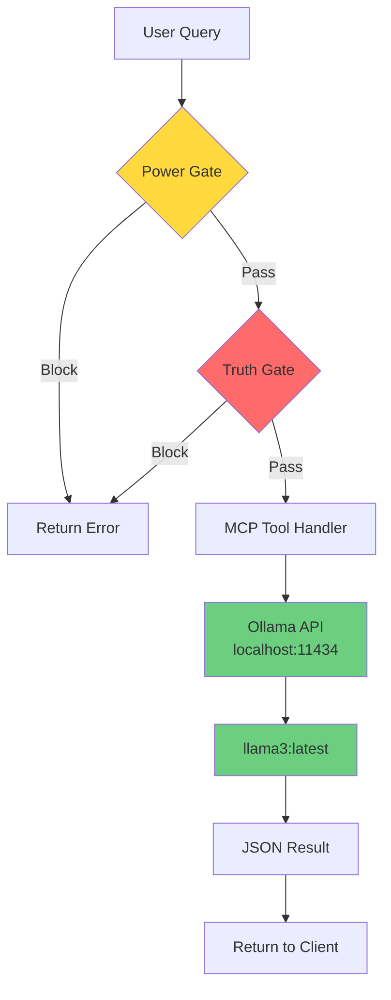

# Authentic Verification Layer (MCP Server)

**A Local-First Forensic Sidecar for AI Agents**

---

## The "Why"

The Authentic Verification Layer is a Model Context Protocol (MCP) server designed for **local** AI agents (Jan Desktop, Claude Desktop, and other MCP-compatible clients). It acts as a "Forensic Sidecar," providing advanced text analysis capabilities while maintaining complete privacy and offline operation.

**Eco-Epistemic Architecture**: This server solves two critical problems facing local AI deployments:

- **Battery Drain**: Heavy GPU workloads can quickly deplete device batteries. Our "Power Gate" circuit breaker blocks oversized inputs before they reach the GPU.
- **Hallucination**: Unverified or unverifiable content leads to unreliable analysis. Our "Truth Gate" boolean filter blocks subjective content, gibberish, and dangerous patterns before AI processing.

All analysis runs through **Boolean Gates** (Truth Gate, Power Gate) that execute **before** waking up the GPU, ensuring zero wasted compute on blocked content.

---

## Features (The Tools)

The server exposes three forensic analysis tools powered by **Llama-3 via Ollama**:

### 1. `scan_for_fallacies`

Analyzes text for logical fallacies and cognitive distortions. Returns a list of detected flaws with confidence ratings.

**Inputs:**
- `text` (string): The raw text to analyze
- `power_mode` ("eco" | "performance"): Power mode - 'eco' limits input to 2000 chars, 'performance' allows up to 10000 chars

### 2. `compare_sources`

Performs a semantic "Word Diff" between two texts on the same topic. Highlights how language differs (e.g., 'Riot' vs 'Protest').

**Inputs:**
- `source_a` (string): Text from the first source
- `source_b` (string): Text from the second source
- `power_mode` ("eco" | "performance"): Power mode - 'eco' limits input to 2000 chars per source, 'performance' allows up to 10000 chars

### 3. `distill_kernel`

Strips all adjectives, adverbs, and emotional loading from text, leaving only the verifiable subject-verb-object facts.

**Inputs:**
- `text` (string): The text to distill
- `power_mode` ("eco" | "performance"): Power mode - 'eco' limits input to 2000 chars, 'performance' allows up to 10000 chars

---

## Architecture



**Flow:**
1. **User Query** → Tool request with input text
2. **Power Gate** → Circuit breaker (blocks oversized inputs in "eco" mode - fastest check)
3. **Truth Gate** → Heuristic filter (blocks gibberish, spam, dangerous patterns, pure opinion)
4. **MCP Tool** → Routes to appropriate handler (`scan_for_fallacies`, `compare_sources`, or `distill_kernel`)
5. **Ollama** → Local LLM API call to `http://localhost:11434/api/generate`
6. **JSON Result** → Parsed response returned to client

---

## Installation & Setup

### Prerequisites

- **Node.js** (v18 or higher)
- **Ollama** installed and running locally
  - Download: https://ollama.ai
  - Verify installation: `ollama --version`
- **Llama-3 model** pulled in Ollama:
  ```bash
  ollama pull llama3:latest
  ```

### Installation Steps

1. **Clone the repository:**
   ```bash
   git clone <repository-url>
   cd authentic-mcp-server
   ```

2. **Install dependencies:**
   ```bash
   npm install
   ```

3. **Build the TypeScript code:**
   ```bash
   npx tsc
   ```

   This compiles the source files in `src/` to JavaScript (same directory).

4. **Verify Ollama is running:**
   ```bash
   curl http://localhost:11434/api/tags
   ```

### Configuration for Jan Desktop

To use this server with Jan Desktop:

1. Open **Jan Desktop Settings**
2. Navigate to **MCP Servers**
3. Click **Add Server** or **Edit** an existing entry
4. Configure as follows:

   **Command:** `node`
   
   **Args:** `/absolute/path/to/authentic-mcp-server/src/index.js`
   
   **Example:**
   ```
   /home/robwistrand/authentic-mcp-server/src/index.js
   ```

   **Note:** Use the **absolute path** to the compiled `index.js` file (not `index.ts`).

5. Restart Jan Desktop to load the server

The server uses **stdio transport** (standard input/output), so no port configuration is needed.

---

## Troubleshooting

### "No Console Log" Rule

**Important**: This server uses **stdio transport** for MCP communication. `stdout` is reserved exclusively for JSON-RPC messages. All logging, debugging, and status messages use `console.error()` (which writes to `stderr`). 

If you see `console.log()` in the code, it will break the MCP protocol. Use `console.error()` instead.

### Jan GPU Crash Fix

If Jan Desktop crashes with GPU-related errors (e.g., `libcudart.so` not found):

1. **Switch to CPU mode** in Jan Desktop settings
2. **Or** configure Ollama to use CPU/Vulkan:
   ```bash
   export OLLAMA_NUM_GPU=0
   ollama serve
   ```

This forces Ollama to run on CPU instead of GPU, avoiding CUDA dependency issues.

### Ollama Connection Issues

- **Connection refused**: Ensure Ollama is running (`ollama serve`)
- **Model not found**: Pull the model (`ollama pull llama3:latest`)
- **Timeout errors**: Check system resources (CPU/RAM) - Llama-3 requires significant resources

### Gate Blocking Issues

- **Power Gate**: Input exceeds character limit for selected `power_mode`
  - Solution: Use `power_mode: "performance"` or reduce input length
- **Truth Gate**: Content appears to be gibberish, spam, or pure opinion
  - Solution: Provide substantive, verifiable content

---

## License

MIT
